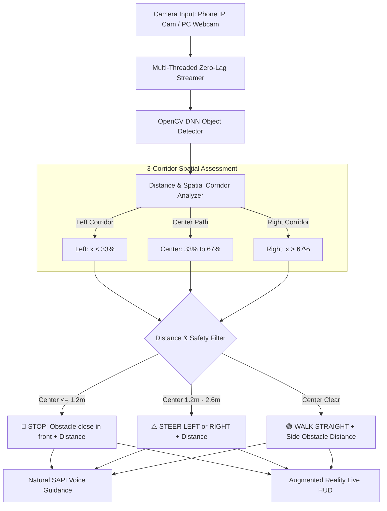

# 🚶 Feature 1: Real-Time Walking Assistance System

> **Module 01** | AI Assistive Vision for Visually Impaired  
> **Core Tech**: OpenCV Deep Neural Network (DNN) + Monocular Depth Triangulation + Asynchronous Spatial Audio

---

## 📌 1. Project Overview

This module provides **real-time walking guidance and obstacle avoidance** for visually impaired individuals using a standard phone camera or wearable webcam.

### 🎯 Key Capabilities:
* **Real-Time Obstacle Detection**: Detects chairs, tables, people, doors, beds, vehicles, and bottles at **35+ FPS**.
* **Monocular Distance / Depth Estimation**: Accurately calculates obstacle distance in meters (e.g., `1.2m`, `2.5m`) without requiring expensive LiDAR or depth cameras.
* **Smart Proximity Filtering (Near vs. Far)**:
  * 🛑 **Immediate Danger (<= 1.2 meters)**: Triggers an urgent `"STOP"` alert.
  * ⚠️ **Steering Range (1.2m - 2.6m)**: Commands `"Steer Left"` or `"Steer Right"`.
  * 🟢 **Far Objects (> 3.2 meters)**: Filtered out to prevent audio spam.
* **3-Corridor Spatial Awareness**: Distinguishes between obstacles on your **Left**, **In Front**, and on your **Right**.
* **Directional Spoken Guidance**: Speaks natural directions with distance (*"Chair ahead, 1.8 meters. Please steer right."*, *"Walk straight. Table on your left, 1.5 meters."*).

---

## 🏗️ 2. How the System Works (Architecture)



---

## 📐 3. Navigation & Distance Rules

### 1. Distance Calculation Formula:
Distance is calculated geometrically from the bottom contact point of the bounding box on the floor:

$$\text{Distance (meters)} = \frac{\text{Camera Height (1.3m)} \times \text{Focal Length (550px)}}{\text{Bottom Y} - \text{Horizon Line}}$$

### 2. Action & Voice Guidance Matrix:

| Situation | Obstacle Distance | Action / Voice Spoken | Visual HUD Color |
| :--- | :--- | :--- | :--- |
| 🛑 **Direct Blockage** | `<= 1.2 meters` (Center) | *"Stop! Chair close in front, 1.1 meters."* | **Red Box** |
| ⚠️ **Approaching Obstacle** | `1.2m to 2.6m` (Center) | *"Chair ahead, 2.1 meters. Please steer right."* | **Orange Box** |
| 🚶 **Path Clear (Side Context)** | `<= 2.6 meters` (Left/Right) | *"Walk straight. Table on your left, 1.8 meters."* | **Orange Box** |
| 🟢 **All Clear** | `> 3.2 meters` (Far) | *"Path clear. Walk straight."* | **Cyan / Safe** |

---

## 📁 4. Project Files

| File | Purpose |
| :--- | :--- |
| [`main.py`](file:///d:/Ashik/project/01_real_time_walking_assistance/main.py) | Main video runner, HUD rendering, and keyboard controls |
| [`config.py`](file:///d:/Ashik/project/01_real_time_walking_assistance/config.py) | Calibrated distance limits, camera resolution, and thresholds |
| [`path_guidance.py`](file:///d:/Ashik/project/01_real_time_walking_assistance/path_guidance.py) | 3-zone spatial analyzer and metric distance calculator |
| [`voice_feedback.py`](file:///d:/Ashik/project/01_real_time_walking_assistance/voice_feedback.py) | Formulates spoken English directions with distance |
| [`shared/object_detector.py`](file:///d:/Ashik/project/shared/object_detector.py) | High-speed OpenCV DNN engine (91 COCO classes) |
| [`shared/camera_stream.py`](file:///d:/Ashik/project/shared/camera_stream.py) | Multi-threaded zero-latency stream reader |
| [`shared/audio_engine.py`](file:///d:/Ashik/project/shared/audio_engine.py) | Non-blocking Windows SAPI text-to-speech worker |

---

## 🚀 5. How to Run

### Method 1: Run via Master Voice Hub (Recommended)
```powershell
python main.py
```
*Say **"Walking assistance"** into your microphone, or press key `1`.*

### Method 2: Run Module Directly
```powershell
# Default saved camera:
python -m 01_real_time_walking_assistance.main

# Using PC Webcam:
python -m 01_real_time_walking_assistance.main --source 0

# Select camera interactively:
python -m 01_real_time_walking_assistance.main --ask
```

### ⌨️ Keyboard Shortcuts:
* `V` — Mute / Unmute Voice Guidance
* `D` — Toggle Corridor Grid Overlay (Left / Center / Right)
* `Q` or `ESC` — Exit

---

## 🎓 6. Viva Voce Examination Questions & Answers (Top 10)

### Q1: What is the primary purpose of this module?
> **Answer**:  
> It provides real-time autonomous walking assistance for visually impaired users. It detects obstacles, calculates real-world distance in meters, categorizes obstacles into Left, Center, and Right corridors, and speaks clear directions (e.g., *"Chair ahead, 2 meters, steer right"*, *"Table on your left, 1.5 meters"*).

---

### Q2: Why use OpenCV DNN instead of heavy deep learning frameworks like PyTorch?
> **Answer**:  
> 1. **Zero External Dependencies**: Runs entirely in C++ via OpenCV, avoiding Windows Security DLL blocks (`shm.dll`).  
> 2. **High Real-Time FPS**: Delivers 35–45 FPS on standard laptop CPUs with low memory usage.

---

### Q3: How do you estimate obstacle distance using only a single monocular camera?
> **Answer**:  
> Using **ground-plane contact geometry**:
> $$\text{Distance} = \frac{\text{Camera Height (1.3m)} \times \text{Focal Length (550px)}}{\text{Bottom Box Y} - \text{Horizon Y}}$$
> Objects closer to the user touch the floor lower on the camera sensor (larger Y coordinate), yielding smaller, accurate distance estimates.

---

### Q4: How do you prevent false alarms from objects far in the background?
> **Answer**:  
> The system applies a **distance filter threshold of 3.2 meters**. Any obstacle farther than 3.2m is treated as background and does not block the path, ensuring the user hears *"Path clear. Walk straight"*.

---

### Q5: How is the walking view divided for directional navigation?
> **Answer**:  
> The camera frame is split into 3 vertical zones:
> * **Left Corridor**: Left 33% (0% to 33%)
> * **Center Walking Path**: Middle 34% (33% to 67%)
> * **Right Corridor**: Right 33% (67% to 100%)  
> Obstacles in the Center path trigger steering or stopping commands based on proximity.

---

### Q6: What triggers a "STOP" command versus a "STEER" command?
> **Answer**:  
> * **STOP**: An obstacle is detected directly in the center path at `<= 1.25 meters` (immediate physical collision danger).
> * **STEER**: An obstacle is in the center path between `1.25m and 2.6 meters` (user has enough time to step left or right safely).

---

### Q7: Why is a multi-threaded camera stream necessary for IP cameras?
> **Answer**:  
> Standard camera capture buffers Wi-Fi video packets, creating 2 to 5 seconds of delay. Our `ThreadedCameraStream` grabs frames in a background thread and keeps only the latest frame, ensuring **0 ms network lag**.

---

### Q8: How is video lag avoided during voice synthesis?
> **Answer**:  
> Spoken audio runs on a separate worker thread using **Windows Native SAPI (`SAPI.SpVoice`)**. The camera loop continues running at 30+ FPS without pausing or freezing during speech.

---

### Q9: What happens if obstacles are present on both the left and right sides?
> **Answer**:  
> * If the center is open: The system guides the user through the middle (*"Walk straight. Table on left, chair on right"*).  
> * If the center is blocked: It evaluates which side has greater clearance distance and steers toward that side. If all sides are blocked within 1.2m, it warns *"Caution - Path blocked"*.

---

### Q10: How does this module integrate into the Master Voice Hub?
> **Answer**:  
> It is connected to [`main.py`](file:///d:/Ashik/project/main.py). The user can activate it hands-free by saying *"Walking assistance"*, *"Start walking"*, or *"Guide me"*, or by pressing hotkey `1`.
