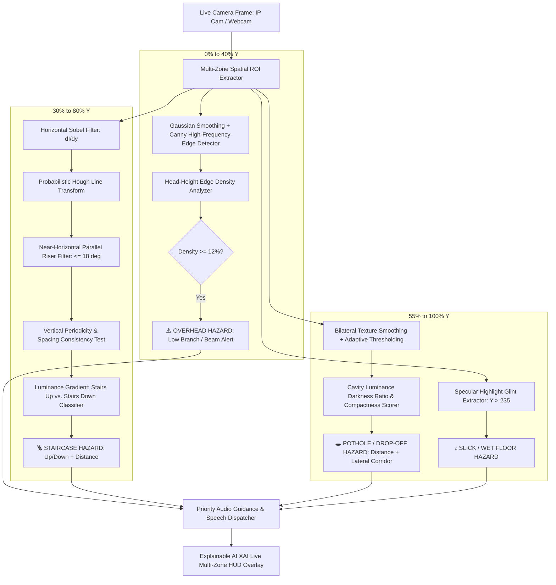

# Feature 3: Obstacle & Path-Hazard Detection System

**Module 03: Ground Drop-offs, Potholes, Staircases (Up/Down), Overhead Hazards & Wet Surface Detection**  
*Part of the 6-Stage AI Assistive Vision Project for Visually Impaired*

---

## 1. Project Overview & Objective

Visually impaired individuals face daily physical injury risks not only from standing obstacles, but crucially from **ground-level structural disruptions and overhead hazards**:
1. **Potholes, Trenches & Ground Drop-offs**: Unseen road holes, missing manhole covers, and curb drop-offs can cause severe falls, fractures, or ankle sprains.
2. **Staircases & Steps (Up vs. Down)**: Distinguishing whether stairs lead upward or downward is essential for safe foot placement and cane coordination.
3. **Overhead & Head-Height Obstacles**: Tree branches, low beams, scaffolding, and awning poles located at eye/head level are missed by traditional walking canes.
4. **Wet & Slippery Surfaces**: Specular glint from wet floors or oil slicks poses immediate slip-and-fall hazards.

This system provides a **Multi-Zone Spatial Computer Vision Engine** that continuously scans vertical field-of-view zones in real time to classify ground drops, staircases, overhead hazards, and slippery planes, delivering prioritized directional speech alerts (*"Warning! Low-hanging obstacle overhead. Duck."*, *"Caution. Stairs down ahead, 1.2 meters."*, *"Pothole ahead, 2 meters."*).

---

## 2. Technical Architecture & Spatial Zoning

The camera view is split into three calibrated vertical zones with dedicated spatial CV pipelines:



---

## 3. Mathematical & Computer Vision Formulations

### 1. Floor Cavity & Pothole Darkness Ratio:
A genuine road cavity or pothole exhibits lower luminance than the surrounding ambient floor plane due to light absorption and shadow casting inside the depression:

$$R_{\text{dark}} = \frac{\mu_{\text{cavity}}}{\mu_{\text{floor}}} \le 0.78$$

Where $\mu_{\text{cavity}}$ is the mean grayscale intensity inside the candidate contour bounding box and $\mu_{\text{floor}}$ is the mean floor plane intensity.

Cavity compactness is computed to filter elongated shadow cracks:
$$\text{Compactness} = \frac{4\pi \cdot \text{Area}}{\text{Perimeter}^2}$$

### 2. Staircase Periodic Riser Line Detection:
Horizontal step edges generate strong vertical image gradients $G_y(x, y) = \frac{\partial I}{\partial y}$. Using the Sobel operator:
$$G_y = \begin{bmatrix} -1 & -2 & -1 \\ 0 & 0 & 0 \\ +1 & +2 & +1 \end{bmatrix} * I$$

Probabilistic Hough Transform detects candidate lines $(x_1, y_1, x_2, y_2)$ filtered for near-horizontal slope:
$$\theta = \arctan\left(\frac{|\Delta y|}{|\Delta x|}\right) \le 18.0^\circ$$

Periodic vertical step spacing consistency $S$ across detected parallel lines:
$$S = 1.0 - \frac{\sigma(d_y)}{\mu(d_y) + \epsilon} \ge 0.60$$

### 3. Stairs Up vs. Stairs Down Classification:
- **Stairs Up**: Ambient light illuminates step tops; mean luminance at bottom risers is equal to or brighter than top steps.
- **Stairs Down**: The floor drops away from the camera, causing deep shadow drop-offs at lower steps ($\mu_{\text{bottom}} < 0.85 \cdot \mu_{\text{top}}$).

### 4. Overhead Eye-Level Hazard Edge Density:
The upper $40\%$ corridor of the frame represents obstacles at head height (e.g., branches, scaffolding poles):
$$D_{\text{edge}} = \frac{N_{\text{edge pixels}}}{W_{\text{overhead}} \times H_{\text{overhead}}} \ge 0.12$$

### 5. Monocular Ground Distance Triangulation:
Given camera mounting height $h_{\text{cam}} \approx 1.45\text{ m}$ (chest/hand height) and horizon line $y_0$:
$$Z = \frac{h_{\text{cam}} \cdot f_{\text{pixels}}}{\max(10, y_{\text{bottom}} - y_0)}$$

---

## 4. Priority Threat Hierarchy & Audio Matrix

| Priority | Hazard Category | Detection Mechanism | HUD Overlay | Voice Command |
|---|---|---|---|---|
| **1 (Highest)** | 🚨 **Overhead Low Branch / Beam** | Upper 40% high-frequency edge density ($D \ge 12\%$) | Magenta Box + Top Guide | *"Warning! Low-hanging obstacle overhead. Please duck."* (Immediate Force Interrupt) |
| **2** | 🚨 **Stairs Down (Drop-off)** | Parallel Hough lines + lower shadow cavity | Deep Orange Box + Riser lines | *"Caution. Stairs down ahead, 1.2 meters."* |
| **3** | ⚠️ **Pothole / Open Manhole** | Ground ROI adaptive contrast cavity | Red / Orange Box + Corridor | *"Warning. Pothole ahead, 2 meters."* |
| **4** | 🪜 **Stairs Up** | Periodic parallel horizontal Sobel lines | Cyan Box + Riser step count | *"Stairs going up ahead, 2.5 meters."* |
| **5** | 💧 **Wet / Slippery Floor** | Ground plane specular glint reflection ($I > 235$) | Blue / Teal Highlight Box | *"Caution. Wet slippery floor detected ahead."* |

---

## 5. Directory Layout

```
d:/Ashik/project/03_obstacle_and_path_hazard_detection/
├── __init__.py                # Package initialization
├── config.py                  # ROI partitions, thresholds & focal length parameters
├── pothole_detector.py        # Bilateral filter & adaptive contrast cavity segmentation
├── staircase_detector.py      # Horizontal Sobel + HoughLinesP periodic step classifier
├── overhead_detector.py       # Eye-level Canny edge density & floor glint detector
├── hazard_voice.py            # Priority-queued non-blocking SAPI voice assistant
├── main.py                    # Real-time multi-zone XAI HUD runner & video stream
└── README.md                  # Technical documentation & 10 Viva Voce Q&As
```

---

## 6. How to Run & Keyboard Controls

### Using Default IP Camera or System Prompt:
```bash
python -m 03_obstacle_and_path_hazard_detection.main
```

### Specifying Explicit IP Camera Stream:
```bash
python -m 03_obstacle_and_path_hazard_detection.main --source http://10.143.52.111:8080/video
```

### Using Laptop Webcam:
```bash
python -m 03_obstacle_and_path_hazard_detection.main --source 0
```

### Keyboard Shortcuts:
| Key | Action |
|---|---|
| `M` | **Mute / Unmute**: Toggle voice warnings |
| `Z` | **Toggle Multi-Zone Guides**: Show/hide overhead and floor ROI horizontal markers |
| `C` | **Switch Camera**: Switch between IP camera and USB webcam on the fly |
| `Q` / `ESC` | **Quit**: Safely shutdown system |

---

## 7. Comprehensive Viva Voce / Oral Examination Questions & Answers

### Q1: What is the main objective of Feature 3 and why can standard object detectors not replace it?
> **Answer**:  
> Standard object detectors (like YOLO) are trained on discrete objects (people, cars, chairs), but completely fail on **structural surface anomalies and environmental path hazards** such as potholes, missing manhole covers, stairs, low-hanging overhead branches, and slippery wet floors. Feature 3 fills this safety-critical gap using **multi-zone spatial computer vision** to detect surface drops, elevation changes, and head-height obstacles.

---

### Q2: How does the system detect potholes and ground drop-offs in real time?
> **Answer**:  
> The system extracts the lower floor plane ($\text{Y} \ge 55\%$) and applies a **bilateral filter** to smooth ground surface textures while preserving sharp cavity borders. It then runs **adaptive Gaussian thresholding** to isolate dark regions. Candidate contours are validated against an **area constraint**, a **cavity darkness ratio** ($R_{\text{dark}} \le 0.78$), and an **elliptical compactness metric**, filtering out flat shadows while detecting true physical depressions.

---

### Q3: How does the system recognize staircases and determine their step count?
> **Answer**:  
> Staircases exhibit a distinct signature of **periodic horizontal edges**. The algorithm applies a **horizontal Sobel filter ($G_y$)** on the mid-ground corridor, followed by a **Probabilistic Hough Line Transform (`cv2.HoughLinesP`)**. It filters for near-horizontal lines ($\theta \le 18^\circ$) and verifies that the vertical spacing between successive steps is periodic and consistent ($\sigma / \mu < 0.40$). The number of matched lines corresponds to the visible step riser count.

---

### Q4: How does the algorithm distinguish between "Stairs Going Up" versus "Stairs Going Down"?
> **Answer**:  
> The distinction relies on **perspective luminance and shadow distribution**:
> - **Stairs Up**: The vertical risers face the camera directly, reflecting ambient illumination uniformly across upper and lower steps.
> - **Stairs Down**: The floor drops away from the camera, creating deep optical shadow cavities in the lower descent steps where light is occluded. If the bottom step region is significantly darker ($\mu_{\text{bottom}} < 0.85 \cdot \mu_{\text{top}}$), the system classifies them as **Stairs Down**.

---

### Q5: How are overhead hazards (branches, low beams) detected before a user strikes their head?
> **Answer**:  
> Traditional white canes only sweep the ground, leaving visually impaired users vulnerable to head-height collisions. Feature 3 monitors the **upper $40\%$ eye-level ROI**. It applies Canny edge analysis to measure **high-frequency structural edge density**. If high edge density ($D_{\text{edge}} \ge 12\%$) is detected in the direct central walking corridor at head level, it triggers an urgent voice alert: *"Warning! Low-hanging obstacle overhead. Duck."*

---

### Q6: How does the system detect wet or slippery floor surfaces?
> **Answer**:  
> Wet surfaces produce **specular reflection highlights (glint)** that reflect ambient light sources at high intensity. The system applies a specular luminance threshold ($I > 235$) in the ground plane ROI. When connected specular highlight clusters exceed a minimum pixel threshold, the system warns the user of slick walking conditions.

---

### Q7: How is distance to a pothole or staircase estimated using a single camera?
> **Answer**:  
> Distance is estimated via **monocular geometric ground-plane projection**:
> $$Z = \frac{h_{\text{cam}} \cdot f_{\text{pixels}}}{\max(10, y_{\text{bottom}} - y_{\text{horizon}})}$$
> Where $h_{\text{cam}} = 1.45\text{ m}$ is the camera height, $f_{\text{pixels}} = 550\text{ px}$ is the calibrated focal length, and $(y_{\text{bottom}} - y_{\text{horizon}})$ is the pixel delta between the object's ground contact point and the optical horizon.

---

### Q8: What priority scheme is used to prevent audio spam when multiple hazards appear simultaneously?
> **Answer**:  
> The system enforces a **strict 5-tier safety priority hierarchy**:
> 1. **Overhead Obstacles** (immediate risk of head concussion / trauma)
> 2. **Stairs Down** (severe fall / tumbling risk)
> 3. **Potholes / Drop-offs** (trip / fracture risk)
> 4. **Stairs Up** (navigation assistance)
> 5. **Wet Surfaces** (caution advisory)  
> Higher priority alerts preempt and silence lower-tier warnings.

---

### Q9: How is the system optimized for low latency and zero camera freeze?
> **Answer**:  
> All image processing uses fast NumPy array slicing and optimized OpenCV C++ primitives, executing in $< 18\text{ ms}$ per frame ($55+\text{ FPS}$). Video capture runs on a dedicated background thread (`ThreadedCameraStream`), and all voice synthesis runs asynchronously via Windows SAPI so the video feed never lags or freezes.

---

### Q10: How does Feature 3 integrate into the Master Voice Control Hub?
> **Answer**:  
> In the master [`main.py`](file:///d:/Ashik/project/main.py), Feature 3 is bound to hotkey `[3]` and voice commands (*"Hazard"*, *"Pothole"*, *"Stairs"*, *"Steps"*, *"Path hazard"*). The user can seamlessly switch between Feature 1 (Walking Assistance), Feature 2 (Vehicle Collision), Feature 3 (Path Hazards), Feature 4 (Face Recognition), Feature 5 (Currency), and Feature 6 (Text Reading) by voice.
