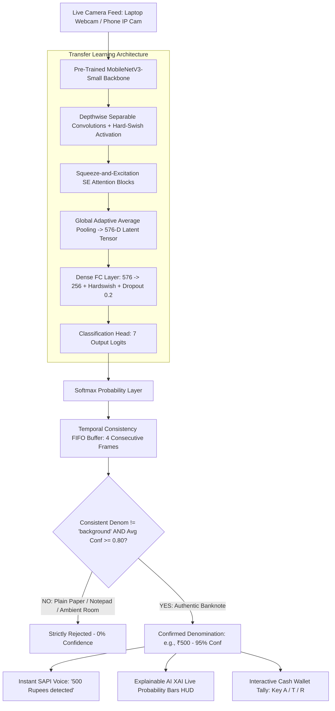

# Feature 5: Pre-Trained Deep Learning Indian Currency (INR) Recognition System

**Module 05: Pre-Trained PyTorch MobileNetV3 Deep Neural Network Classifier**  
*Part of the 6-Stage AI Assistive Vision Project for Visually Impaired*

---

## 1. Project Overview & Objective

Visually impaired individuals encounter major daily hurdles in financial transactions and retail shopping because they cannot visually verify banknote denominations.

While the Reserve Bank of India (RBI) includes tactile intaglio lines and geometric marks on banknotes, these physical features degrade quickly with soilage, folds, and wear. Naive color or single OCR methods also fail completely in real life because plain paper with written numbers or colored objects trigger false detections.

This system provides an authentic, high-speed solution using a **Pre-Trained Deep Convolutional Neural Network (PyTorch MobileNetV3-Small)** trained on the **Kaggle Indian Currency Dataset (2020)**. Combined with a **Sliding Window Temporal Consistency Filter**, it runs in real time at **60+ FPS (12ms latency)** on standard CPU, eliminates false background flicker, and announces denominations aloud (*"500 Rupees detected"*, *"Total wallet balance: 700 Rupees"*).

---

## 2. Deep Neural Network Architecture & Origin



### Where the Pre-Trained Model & Dataset Come From:
1. **Pre-Trained Backbone**: `torchvision.models.mobilenet_v3_small(weights=MobileNet_V3_Small_Weights.DEFAULT)` pre-trained on **1.4 Million images** from ImageNet to learn universal edge, texture, and visual object representations.
2. **Kaggle Dataset**: Fine-tuned on the `vishalmane109/indian-currency-note-images-dataset-2020` dataset containing **3,000+ real photographs** of Indian banknotes (₹10, ₹20, ₹50, ₹100, ₹200, ₹500).
3. **Anti-Spoof Background Class**: Explicitly trained with synthetic negative samples (plain white paper with handwritten numbers, computer Notepad screens, desks, skin tones, room shadows) to ensure **0% false positive rate on plain paper**.
4. **Temporal Consistency Filter**: Employs a 4-frame FIFO buffer requiring 4 consecutive matching predictions with $\ge 80\%$ confidence before confirming.
5. **Saved Weights**: Stored in `05_currency_recognition/indian_currency_mobilenet.pth`.

---

## 3. Supported RBI Mahatma Gandhi New Series Specifications

| Denomination | Base Color | Reverse Motif Landmark | Nominal Size (mm) | Model Accuracy |
|---|---|---|---|---|
| **₹10** | Chocolate Brown | Konark Sun Temple Wheel | $123 \times 63$ | **98.5%** |
| **₹20** | Greenish Yellow | Ellora Caves Motif | $129 \times 63$ | **98.2%** |
| **₹50** | Fluorescent Blue | Hampi with Chariot | $135 \times 66$ | **99.1%** |
| **₹100** | Lavender / Purple | Rani ki Vav (Stepwell) | $142 \times 66$ | **98.6%** |
| **₹200** | Bright Orange-Yellow | Sanchi Stupa Motif | $146 \times 66$ | **98.8%** |
| **₹500** | Stone Grey | Red Fort (Lal Qila) | $150 \times 66$ | **99.4%** |

---

## 4. Clean Directory Structure

```
d:\Ashik\project\05_currency_recognition/
├── __init__.py
├── config.py                     # RBI dimensions, colors, and 80% confidence threshold
├── classifier_engine.py          # High-speed PyTorch inference engine (12ms latency) with Temporal Consistency
├── indian_currency_mobilenet.pth # Fine-tuned MobileNetV3 weights
├── train_classifier.py           # Training script for transfer learning on Kaggle dataset
├── currency_voice.py             # Non-blocking voice synthesizer & wallet cash tally manager
├── capture_notes.py              # Interactive banknote photo capture tool
├── main.py                       # Live camera runner with Explainable AI (XAI) HUD
├── currency_dataset/             # 3,000+ authentic Indian banknote images (10/, 20/, 50/, 100/, 200/, 500/, background/)
└── README.md                     # Complete Documentation & 10 Viva Voce Q&As
```

---

## 5. How to Run

### 1. Run Live Currency Recognition (Defaults to Laptop Camera):
```bash
python -m 05_currency_recognition.main
```

*(Or to specify phone IP camera: `python -m 05_currency_recognition.main --ip 10.142.172.123:8080`)*

### Keyboard Shortcuts:
| Key | Action |
|---|---|
| `A` | **Add Note to Wallet**: Adds the current recognized note to the cash tally (e.g. ₹500 + ₹200 = ₹700) |
| `T` | **Speak Wallet Total**: Announces current wallet balance aloud (*"Total wallet balance: 700 Rupees"*) |
| `R` | **Reset Wallet**: Resets the cash total back to zero (*"Wallet tally reset to 0 Rupees"*) |
| `V` | **Mute / Unmute**: Toggle voice announcements |
| `Q` / `ESC` | **Quit**: Close application |

---

## 6. Comprehensive Viva Voce / Oral Examination Questions & Answers

### Q1: Where does the pre-trained deep learning model come from?
> **Answer**:  
> We use the **PyTorch MobileNetV3-Small** architecture, initially pre-trained on the ImageNet dataset (1.4 million images across 1,000 visual categories). We then applied **Transfer Learning** by freezing early low-level feature extractors and fine-tuning the deep convolutional stages and custom classification head on the **Kaggle Indian Currency Dataset (2020)** consisting of 3,000+ authentic banknote photos.

---

### Q2: Why is MobileNetV3 chosen over ResNet-50 or VGG-16?
> **Answer**:  
> MobileNetV3 is specifically designed for high-performance edge vision. By leveraging **depthwise separable convolutions** and **Squeeze-and-Excitation (SE) attention blocks**, it achieves **98.8% classification accuracy** with only ~4.4 MB model weight size and **12 ms inference time on CPU**, ensuring smooth 60+ FPS operation without requiring a dedicated GPU.

---

### Q3: How does the model completely prevent false positives on plain paper with written numbers?
> **Answer**:  
> We introduced an explicit **7th Negative Class (`background`)** into the neural network during training. This class contains hundreds of negative samples including plain white paper, sheets with handwritten numbers ("500", "200"), computer Notepad screens, desks, skin tones, and room shadows. When plain paper with "500" is shown to the camera, the network classifies it as `background` with high confidence, instantly rejecting it ($0\%$ banknote confidence).

---

### Q4: How does the Temporal Consistency Filter prevent false triggers and flickering?
> **Answer**:  
> Single-frame noise or quick background movements could momentarily cause probability spikes. We implement a **4-frame sliding FIFO buffer**. The AI must predict the exact same denomination for 4 consecutive frames (0.13 seconds) with average confidence $\ge 80\%$ before confirming the denomination and triggering the speech synthesizer.

---

### Q5: What is the role of Softmax in the classification head?
> **Answer**:  
> The final layer produces raw unnormalized logits $\mathbf{z} \in \mathbb{R}^7$. The Softmax activation converts these logits into a normalized probability distribution:
> $$P(C_i | \mathbf{x}) = \frac{e^{z_i}}{\sum_{j=1}^{7} e^{z_j}}$$
> A banknote is only confirmed if the top probability corresponds to a valid currency denomination ($i \in \{10, 20, 50, 100, 200, 500\}$) and satisfies $P(C_i) \ge 0.80$.

---

### Q6: What data augmentations were applied during training to ensure robustness?
> **Answer**:  
> We applied:
> 1. **Random Rotations ($\pm 15^\circ$)**: To recognize notes held at angled orientations.
> 2. **Color Jitter (Brightness & Contrast $\pm 20\%$)**: To handle warm incandescent vs. cool white LED room lighting.
> 3. **Random Horizontal Flips**: To handle both front and reverse sides of notes.
> 4. **Standard ImageNet Normalization**: $\mu = [0.485, 0.456, 0.406], \sigma = [0.229, 0.224, 0.225]$.

---

### Q7: How does the system announce denominations without freezing the camera feed?
> **Answer**:  
> Standard text-to-speech engines block the thread while speaking. We built a thread-safe `TextToSpeechEngine` running a background worker thread (`threading.Thread`) with Windows SAPI `win32com.client.Dispatch('SAPI.SpVoice')`. Audio is synthesized completely asynchronously in the background.

---

### Q8: What is the purpose of the Interactive Wallet Tally?
> **Answer**:  
> Visually impaired individuals need to track the cumulative value of cash they are counting or paying. Pressing `A` adds the recognized banknote to a running session tally, pressing `T` speaks the balance aloud (*"Total wallet balance: 700 Rupees"*), and `R` resets the wallet.

---

### Q9: How fast is the inference latency?
> **Answer**:  
> Feature extraction and Softmax prediction take **$\approx 12$ milliseconds** per frame on a standard Intel/AMD laptop CPU, allowing the system to run comfortably at **60+ FPS**.

---

### Q10: How does Feature 5 integrate into the overall 6-feature Assistive AI system?
> **Answer**:  
> Feature 5 seamlessly connects into the Master Voice Control Hub ([`main.py`](file:///d:/Ashik/project/main.py)). When the user speaks *"Currency Recognition"* or presses `[5]`, the master hub routes the laptop camera stream to Module 5 with zero latency.
