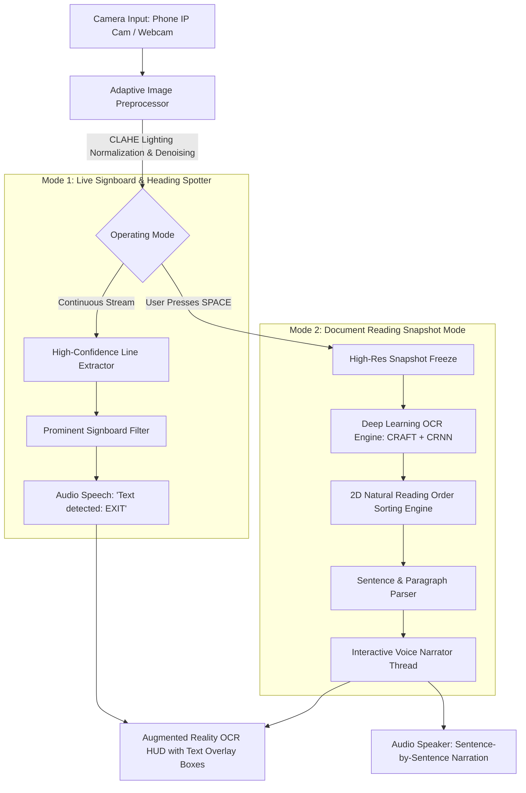

# Feature 6: Text Reading & Audio Narration System

**Module 06: Optical Character Recognition (OCR) & Voice Narration for Visually Impaired**  
*Part of the 6-Stage AI Assistive Vision Project*

---

## 1. Project Overview & Objective

Visually impaired individuals encounter printed and digital text daily—including street signboards, door names, medicine prescriptions, food packaging nutrition labels, transit schedules, and book pages.

This module provides an **autonomous reading assistant** that:
1. **Spots Live Signboards & Headings**: Automatically detects and announces prominent text in the user's field of view (e.g. *"EXIT"*, *"PHARMACY"*, *"DOCTOR ROOM"*, *"DANGER"*).
2. **Reads Full Documents & Book Pages**: Freezes a high-resolution snapshot on command (`SPACE`), enhances contrast, and narratively reads the entire page sentence-by-sentence.
3. **Offers Interactive Speech Controls**: Allows the user to **Pause**, **Resume**, **Repeat**, or **Skip** sentences.

---

## 2. System Architecture & Dual Operating Modes



---

## 3. Deep Learning OCR Pipeline Breakdown

The text reading system combines classical computer vision preprocessing with a two-stage deep learning pipeline:

### 1. Image Preprocessing:
- **Grayscale Conversion**: Eliminates color noise.
- **CLAHE (Contrast Limited Adaptive Histogram Equalization)**: Equalizes localized contrast, making faded text readable even under harsh glare or shadows.
- **Bilateral Filtering**: Smooths out paper grain and sensor noise while keeping character edges razor-sharp.

### 2. Stage 1: Text Detection (CRAFT - Character Region Awareness for Text Detection)
- Locates character regions and inter-character affinities to generate tight bounding polygon coordinates around words and lines at any angle.

### 3. Stage 2: Text Recognition (CRNN - Convolutional Recurrent Neural Network + CTC)
- **CNN Backbone**: Extracts deep visual character feature maps.
- **Bi-LSTM (Bidirectional LSTM)**: Captures sequential linguistic context between characters.
- **CTC (Connectionist Temporal Classification) Loss**: Transcribes variable-length character sequences into plain English text without manual alignment.

### 4. Stage 3: Natural 2D Reading Order Sorting
- Sorts recognized text blocks top-to-bottom and left-to-right to maintain natural human reading flow across multi-column layouts.

---

## 4. Directory & File Breakdown

```
d:\Ashik\project\
├── 06_text_reading/
│   ├── __init__.py
│   ├── config.py             # OCR confidence thresholds, reading speeds, and CLAHE parameters
│   ├── text_extractor.py     # Image preprocessing, neural EasyOCR extraction, reading order sorter
│   ├── reader_voice.py       # Interactive voice narrator with Pause/Repeat/Next sentence controls
│   ├── main.py               # Live camera runner with Text Spotter & Document Reading HUD
│   └── README.md             # Complete Documentation & 10 Viva Voce Q&As
├── shared/
│   ├── audio_engine.py       # Thread-safe Windows SAPI.SpVoice speech worker
│   ├── camera_stream.py      # Zero-lag multi-threaded phone IP camera streamer
│   └── vision_utils.py       # Augmented reality HUD overlays and translucent badges
├── camera_settings.json      # Camera configuration storing phone IP stream address
└── requirements.txt          # Dependencies (including easyocr, torch, torchvision)
```

---

## 5. How to Run the Module

### 1. Run with Phone Camera (IP Webcam / DroidCam):
```bash
python -m 06_text_reading.main --ip 10.127.27.86:8080
```

### 2. Run with Default PC Webcam:
```bash
python -m 06_text_reading.main
```

### 3. Interactive Camera Prompt:
```bash
python -m 06_text_reading.main --ask
```

### Interactive Keyboard Controls:
| Key | Action | Description |
|---|---|---|
| `SPACE` | **Freeze & Read / Unfreeze** | Takes a high-resolution snapshot, processes full text, and begins audio narration |
| `P` | **Pause / Resume** | Pauses or resumes sentence narration |
| `R` | **Repeat Sentence** | Re-reads the current/previous sentence |
| `N` | **Next Sentence** | Skips immediately to the next sentence |
| `V` | **Mute / Unmute** | Toggles voice audio on or off |
| `Q` / `ESC` | **Quit** | Exits application |

---

## 6. Comprehensive Viva Voce / Oral Examination Questions & Answers

### Q1: What is the main objective of this module?
> **Answer**:  
> The module acts as an autonomous reading assistant for visually impaired users. It provides two core functions: (1) **Live Signboard Spotting** to automatically announce ambient headings, room names, and caution signs while walking; and (2) **Document Snapshot Reading** to freeze and sequentially narrate letters, medicine prescriptions, book pages, and packaging text sentence-by-sentence.

---

### Q2: Why is image preprocessing (CLAHE & Bilateral filtering) necessary before OCR?
> **Answer**:  
> Raw images captured by smartphones often suffer from uneven lighting, shadows from hands, glare on glossy paper, and motion blur.  
> 1. **CLAHE (Contrast Limited Adaptive Histogram Equalization)** normalizes localized lighting differences across the page.  
> 2. **Bilateral Filtering** removes high-frequency paper grain and camera noise while preserving sharp character edge gradients, significantly reducing character misrecognition errors.

---

### Q3: What is the deep learning architecture behind EasyOCR (CRAFT + CRNN)?
> **Answer**:  
> 1. **Text Detection (CRAFT)**: A convolutional neural network that detects individual character regions and the affinity (connection) between adjacent characters, allowing it to detect curved, angled, or irregular text lines.  
> 2. **Text Recognition (CRNN)**: Combines a **CNN** (to extract visual feature representations), a **Bidirectional LSTM** (to model character sequence dependencies), and a **CTC (Connectionist Temporal Classification)** layer to predict final words without needing segmented character boundaries.

---

### Q4: How does the system re-order text blocks into natural human reading order?
> **Answer**:  
> Raw OCR detectors return bounding boxes in arbitrary detection order. Our `_sort_reading_order` algorithm:
> 1. Sorts blocks vertically by their top Y-coordinate ($y_1$).
> 2. Groups blocks with overlapping vertical lines into single horizontal lines ($\Delta y < 0.65 \times \text{Line Height}$).
> 3. Sorts each line horizontally from Left to Right ($x_1$).  
> This guarantees natural reading order even on multi-line documents.

---

### Q5: How do you prevent audio lagging during document reading?
> **Answer**:  
> Reading a document takes several seconds or minutes. Running speech on the main video thread would freeze the UI.  
> We implemented a dedicated background **Document Narrator Thread** in `reader_voice.py` that streams text to **Windows SAPI (`SAPI.SpVoice`)**. It monitors an event-driven queue, allowing the camera preview to stay live at 30 FPS while the user interacts with Pause (`P`), Repeat (`R`), and Skip (`N`) controls.

---

### Q6: What is the difference between Live Spotter Mode and Document Reading Mode?
> **Answer**:  
> - **Live Spotter Mode**: Lightweight, continuous background scan (every 1.8s) looking only for high-confidence, short headings and signboards (e.g. *"EXIT"*, *"RESTROOM"*) to keep walking latency minimal.
> - **Document Reading Mode**: Triggered explicitly by `SPACE`. It freezes a static high-res snapshot, processes the entire paragraph structure, and reads long multi-sentence texts sequentially.

---

### Q7: How does this system help visually impaired users with medicine safety?
> **Answer**:  
> Many visually impaired individuals struggle to distinguish medicine boxes that have identical physical shapes. By holding the medicine carton up to the camera and pressing `SPACE`, the system reads the printed drug name, dosage instructions, and expiry date aloud, preventing accidental medication errors.

---

### Q8: How does the system handle multi-lingual text or regional Indian languages?
> **Answer**:  
> While currently configured for English (`['en']`), the underlying EasyOCR framework natively supports over 80 languages—including Hindi (`hi`), Tamil (`ta`), Telugu (`te`), Bengali (`bn`), and Kannada (`kn`). Multi-lingual support can be enabled by simply adding language codes to `config.OCR_LANGUAGES`.

---

### Q9: What are the edge cases and limitations of camera-based OCR?
> **Answer**:  
> 1. **Extreme Motion Blur**: Solved by the freeze-frame snapshot mode (`SPACE`).
> 2. **Highly Stylized / Cursive Fonts**: Can have lower confidence compared to standard sans-serif print.
> 3. **Curved Cylindrical Surfaces (e.g. cans/bottles)**: Addressed by CRAFT's character affinity mapping which handles non-linear text baselines.

---

### Q10: How does Feature 6 complete the Assistive Vision system roadmap?
> **Answer**:  
> Feature 6 completes the **Information Access & Reading** capability of the 6-stage project. Combined with:
> - **Feature 1**: Real-time Walking Assistance (Navigation)
> - **Feature 5**: Currency Recognition (Financial Independence)
> The visually impaired user gains holistic autonomy across physical mobility, commercial transactions, and reading printed material.
