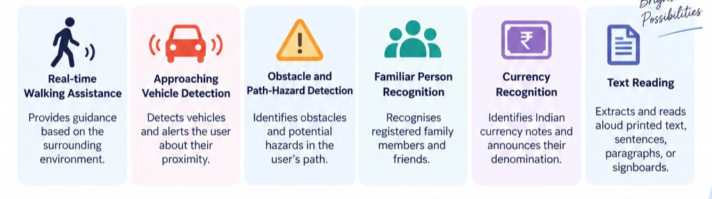

# AI Assistive Vision System for Visually Impaired

An autonomous multi-feature computer vision and voice guidance system designed to empower visually impaired individuals with real-time navigation, safety hazard alerts, person recognition, currency detection, and text reading.



---

## 📁 Complete 6-Feature Architecture & Documentation

Each feature is organized in its own standalone module directory with dedicated implementation code, real-time XAI visual HUDs, asynchronous speech engines, and a complete **Teacher Report & 10 Viva Voce Q&As**:

| Module / Folder | Feature Name | Core Computer Vision / AI Technology | Status | Viva Voce Examination Guide |
|---|---|---|---|---|
| [`01_real_time_walking_assistance/`](file:///d:/Ashik/project/01_real_time_walking_assistance/README.md) | **Real-Time Walking Assistance** | Lightweight OpenCV DNN SSD MobileNet V3 detection, monocular ground-plane distance triangulation, 3-corridor spatial obstacle analysis & directional walking cues (*Walk Straight, Steer Left, Steer Right, Stop*). | ✅ Completed | [View Report & 10 Viva Q&As](file:///d:/Ashik/project/01_real_time_walking_assistance/README.md#5-comprehensive-viva-voce--oral-exam-questions--answers) |
| [`02_approaching_vehicle_detection/`](file:///d:/Ashik/project/02_approaching_vehicle_detection/README.md) | **Approaching Vehicle Detection** | Multi-target optical area expansion tracking $\frac{dA}{dt}$, Time-to-Collision (TTC) physics model, and priority voice crash alerts. | ✅ Completed | [View Report & 10 Viva Q&As](file:///d:/Ashik/project/02_approaching_vehicle_detection/README.md#7-comprehensive-viva-voce--oral-examination-questions--answers) |
| [`03_obstacle_and_path_hazard_detection/`](file:///d:/Ashik/project/03_obstacle_and_path_hazard_detection/README.md) | **Obstacle & Path-Hazard Detection** | Multi-zone spatial CV: Floor adaptive contrast cavities (potholes), Sobel + Hough periodic steps (stairs up/down), eye-level edge density (low branches), and glint reflection (wet floors). | ✅ Completed | [View Report & 10 Viva Q&As](file:///d:/Ashik/project/03_obstacle_and_path_hazard_detection/README.md#7-comprehensive-viva-voce--oral-examination-questions--answers) |
| [`04_familiar_person_recognition/`](file:///d:/Ashik/project/04_familiar_person_recognition/README.md) | **Familiar Person Recognition** | Deep metric learning (YuNet face detector + SFace 128-D cosine distance matcher) to recognize family/friends with spatial direction & distance tags. | ✅ Completed | [View Report & 10 Viva Q&As](file:///d:/Ashik/project/04_familiar_person_recognition/README.md#5-viva-voce-examination-questions--answers-10-qas) |
| [`05_currency_recognition/`](file:///d:/Ashik/project/05_currency_recognition/README.md) | **Indian Currency Recognition** | Pre-trained PyTorch MobileNetV3 CNN trained on Kaggle Indian Currency dataset with 4-frame Temporal Consistency Filter, audio announcement, and cash wallet tally. | ✅ Completed | [View Report & 10 Viva Q&As](file:///d:/Ashik/project/05_currency_recognition/README.md#6-comprehensive-viva-voce--oral-examination-questions--answers) |
| [`06_text_reading/`](file:///d:/Ashik/project/06_text_reading/README.md) | **Text Reading (OCR & TTS)** | Dual-mode OCR reading: (1) Live signboard/heading spotter, and (2) Interactive document sentence narrator with Pause/Repeat/Next speech controls. | ✅ Completed | [View Report & 10 Viva Q&As](file:///d:/Ashik/project/06_text_reading/README.md#6-comprehensive-viva-voce--oral-exam-questions--answers) |
| [`shared/`](file:///d:/Ashik/project/shared/README.md) | **Shared Infrastructure** | Reusable zero-latency camera streaming (`camera_stream.py`), non-blocking SAPI audio engine (`audio_engine.py`), and HUD utilities (`vision_utils.py`). | ✅ Active | [View Shared Docs](file:///d:/Ashik/project/shared/README.md) |

---

## 🎙️ Master Hands-Free Voice Controller (`main.py`)

You can run the unified master application and switch between all 6 features using your **voice** or hotkeys:

```bash
# Launch Master Voice Control Hub:
python main.py
```

### Supported Voice Commands:
| Say into Microphone... | Action | Hotkey |
|---|---|---|
| *"Walking assistance"* / *"Start walking"* / *"Guide me"* | Switches to **Feature 1: Walking Assistance** | `1` |
| *"Vehicle"* / *"Traffic"* / *"Car approaching"* | Switches to **Feature 2: Approaching Vehicle Detection** | `2` |
| *"Hazard"* / *"Pothole"* / *"Stairs"* / *"Steps"* | Switches to **Feature 3: Obstacle & Path Hazard Detection** | `3` |
| *"Person"* / *"Friend"* / *"Who is there"* / *"Face"* | Switches to **Feature 4: Familiar Person Recognition** | `4` |
| *"Currency"* / *"Check money"* / *"Rupees"* / *"Cash"* | Switches to **Feature 5: Currency Recognition** | `5` |
| *"Read text"* / *"Read document"* / *"Signboard"* | Switches to **Feature 6: Text Reading (OCR)** | `6` |
| *"Help"* / *"What can I say"* | Speaks all available voice commands aloud | `H` |
| *"Back"* / *"Main menu"* | Returns to Master Voice Hub | `ESC` |
| *"Exit"* / *"Quit"* | Shuts down application cleanly | `Q` |

---

## 🚀 Individual Feature Direct Launchers

All features automatically use your configured IP camera or webcam from `camera_settings.json`:

```bash
# Feature 1: Real-Time Walking Assistance
python -m 01_real_time_walking_assistance.main

# Feature 2: Approaching Vehicle Detection
python -m 02_approaching_vehicle_detection.main

# Feature 3: Obstacle & Path Hazard Detection
python -m 03_obstacle_and_path_hazard_detection.main

# Feature 4: Familiar Person Recognition
python -m 04_familiar_person_recognition.main

# Feature 5: Indian Currency Recognition
python -m 05_currency_recognition.main

# Feature 6: Text Reading (OCR)
python -m 06_text_reading.main
```

